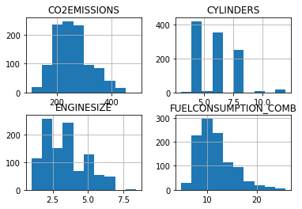
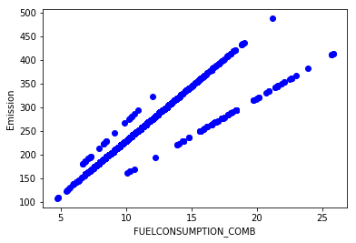
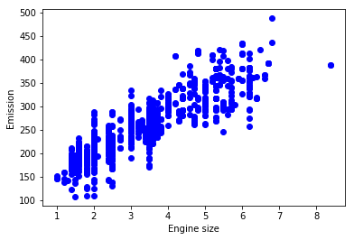
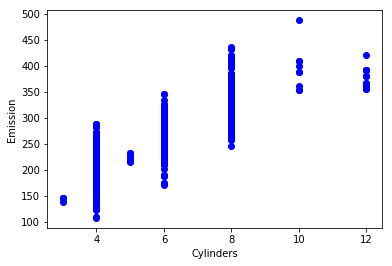

We want to estimate carbon dioxide emissions for new light-duty vehicles based on some attributes such as fuel consumption, enginesize from dataset


```python
import pandas as pd
import numpy as np
import matplotlib.pyplot as plt
%matplotlib inline
```


```python
x=pd.read_csv( 'https://s3-api.us-geo.objectstorage.softlayer.net/cf-courses-data/CognitiveClass/ML0101ENv3/labs/FuelConsumptionCo2.csv')
print(x.head())
# print(x.loc[3])
print(list(x))
```

       MODELYEAR   MAKE       MODEL VEHICLECLASS  ENGINESIZE  CYLINDERS  \
    0       2014  ACURA         ILX      COMPACT         2.0          4   
    1       2014  ACURA         ILX      COMPACT         2.4          4   
    2       2014  ACURA  ILX HYBRID      COMPACT         1.5          4   
    3       2014  ACURA     MDX 4WD  SUV - SMALL         3.5          6   
    4       2014  ACURA     RDX AWD  SUV - SMALL         3.5          6   
    
      TRANSMISSION FUELTYPE  FUELCONSUMPTION_CITY  FUELCONSUMPTION_HWY  \
    0          AS5        Z                   9.9                  6.7   
    1           M6        Z                  11.2                  7.7   
    2          AV7        Z                   6.0                  5.8   
    3          AS6        Z                  12.7                  9.1   
    4          AS6        Z                  12.1                  8.7   
    
       FUELCONSUMPTION_COMB  FUELCONSUMPTION_COMB_MPG  CO2EMISSIONS  
    0                   8.5                        33           196  
    1                   9.6                        29           221  
    2                   5.9                        48           136  
    3                  11.1                        25           255  
    4                  10.6                        27           244  
    ['MODELYEAR', 'MAKE', 'MODEL', 'VEHICLECLASS', 'ENGINESIZE', 'CYLINDERS', 'TRANSMISSION', 'FUELTYPE', 'FUELCONSUMPTION_CITY', 'FUELCONSUMPTION_HWY', 'FUELCONSUMPTION_COMB', 'FUELCONSUMPTION_COMB_MPG', 'CO2EMISSIONS']


```python
#data preparation
cdf=x[['ENGINESIZE','CYLINDERS','FUELCONSUMPTION_CITY','FUELCONSUMPTION_HWY','FUELCONSUMPTION_COMB','CO2EMISSIONS']]
```


```python
viz=cdf[['CYLINDERS','ENGINESIZE','CO2EMISSIONS','FUELCONSUMPTION_COMB']]
viz.hist()
plt.show()
```





```python
## plot fuel vs co2
plt.scatter(cdf.FUELCONSUMPTION_COMB, cdf.CO2EMISSIONS,  color='blue')
plt.xlabel("FUELCONSUMPTION_COMB")
plt.ylabel("Emission")
plt.show()
```





```python
## plot enginesize vs co2
plt.scatter(cdf.ENGINESIZE, cdf.CO2EMISSIONS,  color='blue')
plt.xlabel("Engine size")
plt.ylabel("Emission")
plt.show()
```





```python
## plot cylinders vs co2
plt.scatter(cdf.CYLINDERS,cdf.CO2EMISSIONS,color='blue')
plt.xlabel('Cylinders')
plt.ylabel('Emission')
plt.show()
```





```python
# ##split
# msk=np.random.rand(len(x)) < 0.8
# train=cdf[msk]
# test=cdf[~msk]
## or using split_train_test
from sklearn.model_selection import train_test_split
x_train,x_test,y_train,y_test=train_test_split(viz[['ENGINESIZE','CYLINDERS','FUELCONSUMPTION_COMB']],cdf['CO2EMISSIONS'],test_size=0.3)
```


```python
from sklearn.linear_model import LinearRegression
model=LinearRegression()
# x_train=np.asanyarray(train[['ENGINESIZE','CYLINDERS','FUELCONSUMPTION_COMB']]) #convert to array, pass the ndarray subclasses
# y_train=np.asanyarray(train[['CO2EMISSIONS']])
model.fit(x_train,y_train)
print('coef',model.coef_)
```

    coef [11.08289508  7.25001363  9.55970937]


```python
##prediction
# x_test = np.asanyarray(test[['ENGINESIZE','CYLINDERS','FUELCONSUMPTION_COMB']])
# y_test = np.asanyarray(test[['CO2EMISSIONS']])
pred=model.predict(x_test)
print("Residual sum of squares: %.2f"
      % np.mean((pred - y_test) ** 2))
print("score = %.2f" % model.score(x_test,y_test))
```

    Residual sum of squares: 631.43
    score = 0.85


We can use other attibutes, to get better accuracy


```python
from sklearn.model_selection import train_test_split
x_train,x_test,y_train,y_test=train_test_split(cdf[['ENGINESIZE','CYLINDERS','FUELCONSUMPTION_CITY','FUELCONSUMPTION_HWY']],cdf['CO2EMISSIONS'],test_size=0.3)
model.fit (x_train, y_train)
# The coefficients
print ('Coefficients: ', model.coef_)
y_pred=model.predict(x_test)
print('Residual sum of square: %.2f'% np.mean((y_test-y_pred)**2))
print('Var score: %.2f'% model.score(x_test,y_test))
```

    Coefficients:  [10.64305958  6.56158449  6.9667865   2.37853099]
    Residual sum of square: 580.37
    Var score: 0.87

